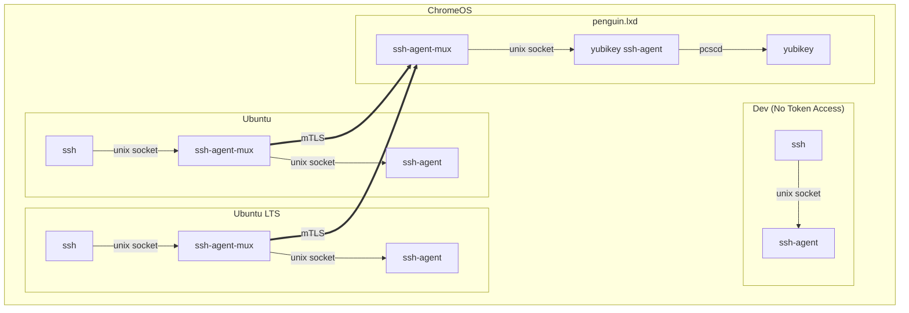

# SYNOPSIS

ssh-agent-mux proxy [*options*] *local* *remote* *...*

# DESCRIPTION

Proxy ssh-agent sessions to local or remote ssh-agents.

`ssh-agent-mux` proxies ssh agent requests to one or more backend ssh
agents. The agents may be running on the local system using Unix sockets
or accessed remotely over the network.

## Rationale

The default `penguin.lxd` ChromeOS container has access to hardware
tokens like the Yubikey. Other containers cannot access the token.



# BUILDING

```
go install github.com/msantos/ssh-agent-mux/cmd/ssh-agent-mux@latest
```

To build a reproducible executable from the git repository:

```
CGO_ENABLED=0 go build -trimpath -ldflags "-w" ./cmd/ssh-agent-mux
```

# EXAMPLES

## Server

```
ssh-agent-mux proxy mtls://[::]:10080 $SSH_AUTH_SOCK
```

## Client

```
ssh-agent-mux proxy agent.sock $SSH_AUTH_SOCK mtls://penguin.lxd:10080
```

# AGENT PROTOCOL EXTENSIONS

SSH agent protocol extension requests are controlled by the `--extensions`
argument. By default, extension requests return an extension unsupported
error.

The `--extensions` flag is a list of space separated matches. Each match
consists of a `behaviour`:`regexp`. The regular expression matches the
agent extension name.

```
ssh-agent-mux proxy --extensions="all:ext1@example.com first:ext2@example.com any:ext3@example.com" \
  agent.sock $SSH_AUTH_SOCK mtls://penguin.lxd:10080
```

To match all agent extensions:

```
--extensions "first:."
```

## Behaviours

Extension requests are sent to the backends in the order specified on
the command line.

Behaviours skip backends which do not support the extension. If no
backends support the extension, the proxy returns agent extension
unsupported.

all
: the extension request is sent to all supported backends, returning any errors

first
: the response is returned from the first backend supporting the extension

any
: the extension request is sent to each supported backend. If a backend
returns an error, the next backend is tried. If a backend returns success,
the proxy returns success.

# COMMANDS

## proxy

The listening and remote sockets are URL formatted. Supported schemes are:

* `unix`: unix socket
  * example: unix:///tmp/agent-test.s
  * paths can also be used: /tmp/agent-test.s
* `tcp`: unencrypted TCP socket
  * example: tcp:///penguin.lxd:10080
* `tls`: TLS socket
  * example: tls:///penguin.lxd:10080
* `mtls`: mutual TLS socket (TLS with client certificate)
  * example: mtls:///penguin.lxd:10080

Options are appended to the scheme:
* `insecure`: disable certificate checks for testing
  * example: mtls+insecure:///penguin.lxd:10080

### Options

extensions *string*
: Proxy ssh agent extensions

tls-cert *string*
: TLS server cert (default "$XDG_CONFIG_HOME/ssh-agent-mux/cert.pem")

tls-client-cert *string*
: TLS client cert (default "$XDG_CONFIG_HOME/ssh-agent-mux/client.pem")

tls-client-key *string*
: TLS client key (default "$XDG_CONFIG_HOME/ssh-agent-mux/client-key.pem")

tls-key *string*
: TLS server key (default "$XDG_CONFIG_HOME/ssh-agent-mux/key.pem")

tls-rootca *string*
: TLS root CA file (default: $XDG_CONFIG_HOME/ssh-agent-mux/rootca.pem, system CA root)

# CONFIGURATION

## TLS

TLS client and server certs can be generated using openssl or a utility
like [mkcert](https://github.com/FiloSottile/mkcert):

### Server

* create the root CA and server cert

```
mkcert penguin.lxd
```

* copy the root CA and server cert to `$XDG_CONFIG_HOME/ssh-agent-mux` (by default: `$HOME/.config/ssh-agent-mux1)

```
mkdir -p $HOME/.config/ssh-agent-mux
chmod 700 $HOME/.config/ssh-agent-mux

cp penguin.lxd-key.pem $HOME/.config/ssh-agent-mux/key.pem
cp penguin.lxd.pem $HOME/.config/ssh-agent-mux/cert.pem
cp $HOME/.local/share/mkcert/rootCA.pem $HOME/.config/ssh-agent-mux/rootca.pem
```

* create a client certificate

```
# client: find the hostname
$ hostname
ubuntu

# server: generate the client cert
# ChromeOS: use the default FQDN
mkcert --client ubuntu.lxd
```

* transfer the client cert, key and root CA to the client

```
# ChromeOS
cp ubuntu.lxd-client-key.pem  ubuntu.lxd-client.pem $HOME/.local/share/mkcert/rootCA.pem /mnt/chromeos/MyFiles/Downloads/
```

### Client

* copy the client cert, key and root CA to `$XDG_CONFIG_HOME/ssh-agent-mux` (by default: `$HOME/.config/ssh-agent-mux1)

```
# ChromeOS
mkdir -p $HOME/.config/ssh-agent-mux
chmod 700 $HOME/.config/ssh-agent-mux

mv /mnt/chromeos/MyFiles/Downloads/ubuntu.lxd-client-key.pem $HOME/.config/ssh-agent-mux/client-key.pem
mv /mnt/chromeos/MyFiles/Downloads/ubuntu.lxd-client.pem $HOME/.config/ssh-agent-mux/client.pem
mv /mnt/chromeos/MyFiles/Downloads/rootCA.pem $HOME/.config/ssh-agent-mux/rootca.pem
```

# ALTERNATIVES

* [socat](http://www.dest-unreach.org/socat/)
