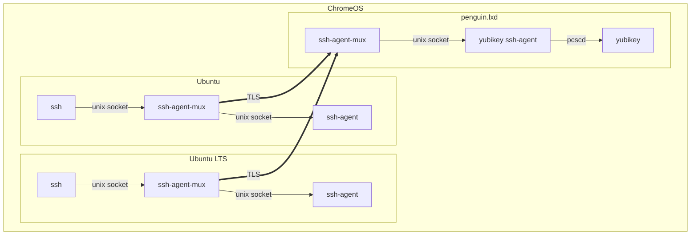

# SYNOPSIS

ssh-agent-mux proxy [*options*] *local* *remote* *...*

# DESCRIPTION

Proxy ssh-agent sessions to local or remote ssh-agents.

`ssh-agent-mux` proxies ssh agent requests to one or more backend ssh
agents. The agents may be running on the local system using Unix sockets
or accessed remotely over the network.

## Rationale

On ChromeOS, the default `penguin.lxd` container can access hardware
tokens like the Yubikey. Other containers do not have access to the token.



# BUILDING

```
go install github.com/msantos/ssh-agent-mux/cmd/ssh-agent-mux@latest
```

To build a reproducible executable from the git repository:

```
CGO_ENABLED=0 go build -trimpath -ldflags "-w" ./cmd/ssh-agent-mux
```

# EXAMPLES

## Server

```
ssh-agent-mux proxy mtls://[::]:10080 $SSH_AUTH_SOCK
```

## Client

```
ssh-agent-mux proxy agent.sock $SSH_AUTH_SOCK mtls://penguin.lxd:10080
```
